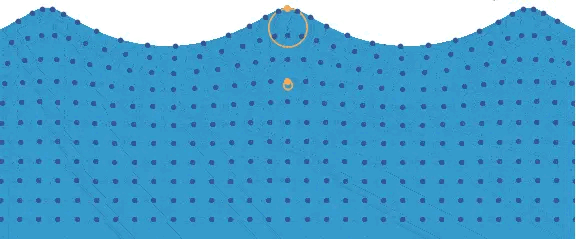

# 1. 几何部分
## 球的几何 

**---> 难点在于如何去做lod？**    

[参考代码在此](https://github.com/bicarbon8/QuadSphere)    

四叉树划分球面，一个球面由6个四叉树构成（为了方便剔除）。    
在具体渲染的时候，可以边剔除边做细分，因为这个操作并不是开销很大（或许，但是很节省内存    

具体的做法就是：    
先在四叉树上dfs遍历节点，对于某个节点，如果小于当前距离匹配的四叉树层数，就可以继续进入它的孩子，如果它并没有孩子，就生成一个，只有到了于距离匹配的层数的节点的时候，才会生成vb。      

   

如果到了目标节点，但是其还有孩子，那么可以删除孩子...然后在本层创建一次，当然最好是不删除    

如果存在这种情况，有两个相邻节点，他们的lod层级不统一（和它相邻的节点深度之差不会大于1的情况下），那么精细节点会向粗糙节点进行迁就。   
具体规则可以理解为：如果某一邻边对应的节点有着粗糙的lod等级，那么这个邻边上的点就会进行对应的减少，防止接缝的出现     
    
根据上图的16种node来进行操作lod的衔接     

球面地形的几何部分就完成了。     

## 海洋的几何形变

**---> 选择什么方法，如何制造交互？**     
浪，浪卷，其实就是在球面地形上做几何形变    
这部分参考很多，无非是各种不同的波叠加    
第一个做球海洋的同事做很多的调研，我也放在此处   

---------------------    

1.Jerry Tessendorf FFT 波（玩FFT绕不开的大哥）
https://people.computing.clemson.edu/~jtessen/reports/papers_files/coursenotes2004.pdf 

2.Eric Bruneton（Gerstner wave 必看）
https://inria.hal.science/inria-00443630/PDF/article-1.pdf 

3.The Art of Outer Wilds | Unity Creator Spotlight（里面有他们球面水的一个小介绍）
https://www.youtube.com/watch?v=Ww12q6HsmJA&ab_channel=Unity  

4.Real-Time Rendering of Procedurally Generated Planets（球面Gerster wave）的参考
https://www.youtube.com/watch?v=i5uowweBeyI&ab_channel=CESCG 
https://drive.weixin.qq.com/s?k=AEQAcgfiABEiOfAsCWAfYAzQZpAJc 

5.NVIDIA WaveWorks FFT水面加物理的实现 半开源
https://developer.nvidia.com/waveworks 

6.Gerster Wave水面模拟 很好的一个教程
https://catlikecoding.com/unity/tutorials/flow/waves/      

-----------------------    

我们目前用的是Gerstner Wave，说白了就是海面面片上的所有顶点都在做圆周运动    

    

目前使用了4个gerstner wave叠加，效果据说还不错...我觉得一般。   

# 2. 渲染部分     

## 水底下的折射

海洋不透明，原因是第一任球海洋作者发现：    
因为星球是带曲率的，所以可能出现在某个角度，看向海洋的时候，能同时看到背面的海洋。如果使用背面剔除，可以解决，但是在水底下的时候就会没有海面了。        

因此现在使用的是不透明渲染＋不写入深度      
背面剔除画一遍再加正面剔除画一遍。    
#### but
但是最后发现同事告诉我的错了，实际上是完全画了两边--第一遍不写入颜色只写深度，第二遍才写入颜色   
这样约等于一个低效率的prez，那为什么不直接正常画一遍呢？   
      
那么水底下的折射该如何做？在渲染管线内部存在一个backbuffer，backbuffer大概就是会在所有（不透明？或者低于某个渲染权重的）物体渲染之前，把当前fb保存一份。那么如果要渲染水底下，就会去采样这个backbuffer，然后根据海洋的参数做个扭曲折射。    
有时候也会把角色采样进去，然后搞出奇怪的扭曲...如同角色灵魂出窍   
因此可以去使用backbuffer中的深度值和当前要渲染地方的深度值作比较，如果这地方比水深，渲染折射，反之不渲染    

## 波浪怎么渲染     

三平面法线映射

